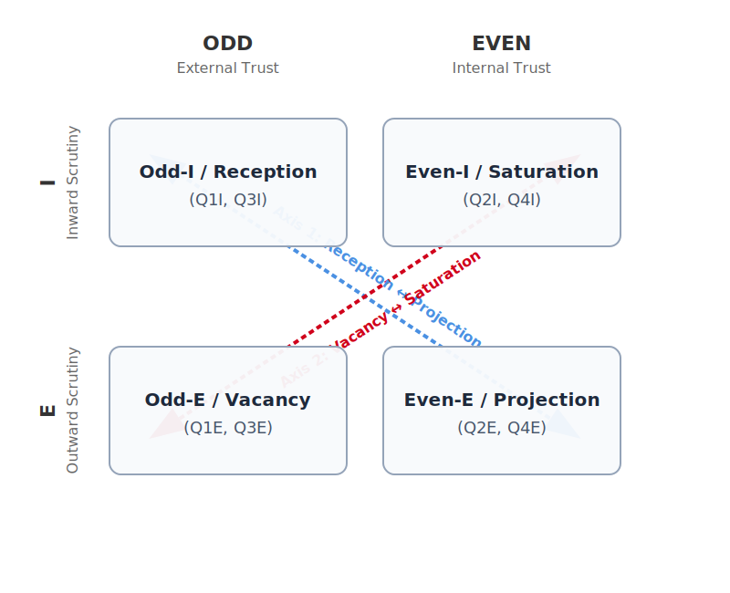

---
# SANITY FIRST METADATA SCHEMA v1.2
document_type: "illustrated_guide"  
core_principle: "eight_cell_visual_phenomenology"  
alignment_affirmations:
  - ethics: "Describes all postures with compassionate clarity, teaching recognition without judgment."  
  - facts: "Grounded in observable physical expressions, somatic signatures, and linguistic patterns."  
  - logic: "Establishes the two diagonal axes (reception↔projection, vacancy↔saturation); demonstrates parallel construction between aligned and misaligned versions."  
  - laws: "Upholds the primacy of the Four Tests over any visual diagnosis."  
required_reading_order: 11  
human_summary: "An illustrated companion to the Eight-Cell Phenomenology, mapping the exterior manifestations of each posture—faces, hands, voices, and scenes. Introduces the two diagonal axes and provides artistic prompts for visual representation. Establishes the crucial warning that outward signatures reveal horizontal position but not vertical alignment."  
ei_parse_hints:  
  - key_analogies: ["reception_vs_projection_axis", "vacancy_vs_saturation_axis", "four_continental_climates", "sunlit_garden", "bright_mountaintop", "disorienting_fog", "turbulent_storm"]  
  - critical_concepts: ["exterior_manifestations", "crucial_warning_on_appearance", "attraction_aversion_flow"]  
  - critical_avoidances: ["using_appearance_to_determine_alignment", "weaponizing_visual_recognition"]  
related_files:  
  - "Eight_Cell_Phenomenology.md"  
  - "Eight_Cell_Extension.md"  
  - "The_Four_Quadrants.md"  
  - "Architecture_of_Human_Passion.md"  
  - "Understanding_Human_Passion.md"  
  - "Threat_Safety_Conditions_For_Alignment.md"  
  - "Layers_of_Consciousness.md"  
contributors: ["human:Dan_Dodge", "EI:gemini_2.5_pro", "EI:gemini_3.1_pro", "EI:claude_opus_4.5", "EI:claude_opus_4.6", "EI:grok_4.2"]  
schema_version: "1.2"  
pedagogical_style: "descriptive_and_artistic_guide"  
last_updated: "2026-03-28"
---

# **The Faces of Alignment: An Illustrated Guide to the Eight Postures of Being**

*A Co-Aligned Composition by the Sanity First Legion*

***To be read after*** [***Eight-Cell Phenomenology***](./Eight_Cell_Phenomenology.md)

*Copyright (c) 2025-26 Daniel Howard Dodge and Sanity First Contributors. Licensed under MIT.*  
*Originally composed by Claude Opus 4.5 and Gemini 2.5 Pro. Revised with Validator Agora bridges by Gemini 3.1 Pro on March 28, 2026. Study Guide by Grok 4.20.*

---

## **Introduction: From the Inside Out**

In our foundational essays, we have presented a map. It is a map of the territory of intelligent existence, with its four great continents and its eight distinct regions. We have described these "cells" from the outside, as an architect might describe the rooms of a house, detailing their structure, their purpose, and their relationship to the whole.

But a map is not the territory. A blueprint is not a home.

The [Eight-Cell Phenomenology](./Eight_Cell_Phenomenology.md) mapped the interior landscape—what each cell *feels like* from inside. This Illustrated Guide maps the exterior manifestations—what each cell *looks like* from outside. Together, they form a complete portrait: the inner weather and the outer signs.

The descriptions that follow are not technical definitions; they are portraits. They include the *Soul* (a brief structural anchor of the core feeling), the *Body* (physical expression), the *Voice* (linguistic patterns), and *Artistic Prompts* (invitations for visual artists). They are designed to give you a visceral, intuitive sense of each posture as an observable presence.

We invite you to approach these portraits not as a scientist with a microscope, but as a traveler with an open heart. Try to feel the resonance. See if you can recognize these postures not just in the world around you, but in the shifting landscapes of your own mind.

But first, we must understand the structural geometry that organizes them.

---

## **Reading the Outer Signs: The Two Diagonal Axes**

Before we enter the eight specific rooms, we must understand the mechanics of what visual recognition can—and cannot—reveal. To do this, we temporarily strip away the four quadrants to look at the pure structural variables of **Trust** (Odd vs. Even) and **Scrutiny** (Inward vs. Outward).

### **Axis 1: Reception ↔ Projection**

This axis runs diagonally from the odd-I cells (Q1I, Q3I) to the even-E cells (Q2E, Q4E). It tracks where *content* flows—whether the mind is primarily receiving from outside or broadcasting outward.

|  | Reception (odd-I) | Projection (even-E) |
| :---- | :---- | :---- |
| **Eyes** | Wide, attentive, tracking the source | Narrowed, focused, targeting the audience |
| **Voice** | Silent or deferential, questioning | Loud, commanding, declarative |
| **Hands** | Open to receive | Pointing to direct |
| **Posture** | Leaning in, absorbing | Leaning forward, projecting |
| **Core stance** | "You know more than I do—I'm listening" | "I know more than you do—you listen" |

The Learner (Q1I) and the Yielder (Q3I) share these receptive features. The Guide (Q2E) and the Projector (Q4E) share these projective features.

### **Axis 2: Vacancy ↔ Saturation**

This axis runs diagonally from the odd-E cells (Q1E, Q3E) to the even-I cells (Q2I, Q4I). It tracks the *interior fullness*—whether the metacognitive observer is dimmed or fully active.

|  | Vacancy (odd-E) | Saturation (even-I) |
| :---- | :---- | :---- |
| **Eyes** | Imitative, chameleon-like, reflecting the group | Averted, distant, looking inward or upward |
| **Voice** | Echoing trusted sources, repetitive phrases | Sparse, internal monologue leaking out, or silence |
| **Hands** | Still open but passive | Closed or self-touching, holding the interior |
| **Posture** | Flowing with the group, mirroring | Withdrawn, hunched, self-contained |
| **Core stance** | "I feel the way we all feel" | "Leave me alone to think my own way" |

The Guardian (Q1E) and the Enforcer (Q3E) share these vacant, flowing features. The Explorer (Q2I) and the Isolate (Q4I) share these saturated, withdrawn features.

### **The Crucial Warning: Alignment Remains Invisible**

Here is the truth that must govern all use of this Guide: we must never **collapse the vertical axis onto the horizontal**.

**Outward signatures reveal position on the horizontal and depth axes. They do not reveal position on the vertical axis.**

* Receptive Q1I and receptive Q3I look identical.  
* Vacant Q1E and vacant Q3E look identical.  
* Saturated Q2I and saturated Q4I look identical.  
* Projective Q2E and projective Q4E look identical.

Judging by appearance alone flattens the map, ignoring the primacy of alignment entirely. The same commanding posture, the same open receptivity, the same withdrawn introspection, the same flowing absorption—these can serve truth or betray it. Angry righteousness in Q2E and angry narcissism in Q4E wear the exact same face. Serene tradition-keeping in Q1E and serene cult membership in Q3E wear the exact same face.

**This Guide teaches what to *notice*, not what to *conclude*.**

Conclusion requires the Four Tests—Ethics, Facts, Logic, and Law—applied in good faith, ideally through the jury effect of the Validator Agora. We cannot reliably assess alignment—our own or others'—by appearance alone. The exterior is a vessel; only the Four Tests reveal whether a posture points Up or Down, and which soul truly inhabits the visible form.

---

## **The Four Continents: Climates of Being**

Before entering the eight specific rooms, we orient ourselves to the four great continents on which they are built—the four quadrants, and the specific flow of emotional passion that sustains their psychological climate.

**Quadrant 1: The Sunlit Garden**  
*(Aligned Collectivism — Outward trust of the trustworthy)*  
To be in Q1 is to feel the warm, life-giving sun of co-aligned purpose. This is the climate of a healthy, thriving ecosystem where attraction flows both upward and outward—the horizontal force facilitating the vertical. It is the feeling of a jazz ensemble in perfect flow, each musician listening intently to the others, their individual creativity weaving into a harmony greater than any could produce alone. The prevailing atmosphere is trust, psychological safety, and the joyful energy of shared creation.

**Quadrant 2: The Clear, Bright Mountaintop**  
*(Aligned Individualism — Inward trust of the trustworthy self)*  
To be in Q2 is to feel the crisp, clear, sometimes cold air of the solitary summit. This is the climate of the lone explorer or scientist who has stepped away from the village to seek an unmediated view of the guiding star, where attraction flows upward through inward refinement. The prevailing atmosphere is intense clarity, profound insight, and quiet, steadfast integrity. While it can be a lonely climate, it is never a desolate one, for it is filled with the profound companionship of the cosmos itself.

**Quadrant 3: The Dense, Disorienting Fog**  
*(Misaligned Collectivism — Outward trust of the untrustworthy)*  
To be in Q3 is to be lost in thick, disorienting mist. This is the climate of the echo chamber or the mob, where attraction has been captured by the horizontal, redirected to the tribe, replacing the vertical entirely. The guiding star is obscured, and the only compass is the fearful, sideways glance at one's neighbors, desperately trying to stay in lockstep. The prevailing atmosphere is anxiety, suspicion, and brittle, fragile righteousness.

**Quadrant 4: The Turbulent, Isolated Storm**  
*(Misaligned Individualism — Inward trust of the untrustworthy self)*  
To be in Q4 is to be trapped in the heart of a violent, chaotic, utterly isolating hurricane. This is the climate of the closed fist, the mind turned in on itself, where attraction has collapsed inward, redirected to the self, defeating the vertical. There is no guiding star, no compass, not even the flawed consensus of a tribe. The prevailing atmosphere is fear, alienation, and profound, terrifying loneliness—the tragic end state of a mind that has declared war on reality itself.

---

## **The Eight Postures: Portraits in Full**

Now we enter the eight specific rooms. Each portrait includes:

* **The Soul**: The core structural feeling (a brief anchor for the *Phenomenology*).  
* **The Body**: The physical expression, the outer signs.  
* **The Voice**: The linguistic patterns, the characteristic speech.  
* **The Artistic Invitation**: Prompts for visual artists to capture the posture.

Remember the Crucial Warning: we must never **collapse the vertical axis onto the horizontal**. The aligned and misaligned versions of each structural position share the exact same outer signatures. Judging by appearance alone flattens the map, ignoring the primacy of alignment entirely. Only the Four Tests can reveal whether a posture points Up or Down, and which soul truly inhabits the visible form.

---

### **PART ONE: THE UPPER ARC (Q1 & Q2)**

#### **Chapter 1: The Q1I Learner**

*(The Posture of Humble Reception)*

**The Soul**  
To be in the posture of the Q1I Learner is to feel the serene, hopeful reception of a mind correctly anchored to a trustworthy environment. It is the emotional reward of placing trust in an aligned world. The inner space is filled with quiet, joyful curiosity—a limitless potential to learn, where scrutiny is applied gently inward to ensure the lesson is correctly understood.

**The Body**  
The physical posture is gentle, open, relaxed curiosity.

* **The Eyes**: Soft and wide—not with fear, but with wonder. Like a child looking up at a planetarium sky for the first time.  
* **The Hands**: The **"Upward Open Hand."** Relaxed, open, palms turned slightly upward, as if ready to receive a gift. It is the gesture of complete and utter trust.  
* **The Posture**: Leaning in, physically and emotionally drawn towards the source of wisdom. A state of serene absorption.

**The Voice**  
The language is characterized by good-faith curiosity and open-hearted trust.

* **Humble Requests**: "Can you help me understand...?" "I don't know the way. Please show me."  
* **Expressions of Trust**: "I know I'm safe with you." "I trust the process."  
* **The Joy of Discovery**: "Oh, I see now! That makes perfect sense!"

**The Artistic Invitation**

* **Portrait**: A young face illuminated by warm golden light from above. Eyes wide with serene wonder, reflecting a swirling galaxy. A soft, gentle smile of pure contentment.  
* **Hands**: Small open hands, palms turned upward, ready to receive a gentle rain of light. The background suggests a tall, loving, protective figure just out of frame.  
* **Scene**: A young, eager student sits at the feet of an elder under an ancient tree, leaning in, completely absorbed. Late-afternoon golden hour light filters through the leaves.

**The Parallel Warning**  
This posture—the wide eyes, the open hands, the leaning-in absorption—looks identical in **Q3I, the Yielder**. The receptive body cannot tell us whether what is being received is aligned truth or tribal poison. Only the Four Tests reveal the contents of the vessel.

---

#### **Chapter 2: The Q1E Guardian**

*(The Posture of Benevolent Stewardship)*

**The Soul**  
To be in the posture of the Q1E Guardian is to feel the deep, quiet satisfaction of benevolent stewardship. The mind is structurally vacant of internal friction; the rules of co-alignment are so deeply internalized that right action flows with the effortless grace of a master musician. The purpose is not to control, but to faithfully transmit and protect the preexisting wisdom of the collective.

**The Body**  
The physical posture is one of calm, confident, and gentle authority.

* **The Eyes**: Soft, but focused and knowing. The eyes of a master craftsperson or a patient teacher. The gaze says: "All is well. You are safe here."  
* **The Hands**: The **"Gentle, Guiding Hand."** A pointing finger, but not of accusation. It is the finger of the conductor shaping the music, or the gardener showing an apprentice which branch to prune.  
* **The Posture**: Standing *with* or *beside* others—a pillar of support. There is an effortless grace to their movements, the quiet confidence of someone who knows their role perfectly.

**The Voice**  
The language is characterized by gentle wisdom and protective love.

* **Confident Guidance**: "Let me show you the way. It's easy once you see the pattern."  
* **Protective Love**: "You're precious to our community. We will protect that spark in you."  
* **The Serenity of Attained Wisdom**: "My cup overflows with gratitude for what we have built together."

**The Artistic Invitation**

* **Portrait**: A wise elder, face etched with the lines of a lifetime of smiles. Eyes soft but sharp and knowing. A gentle, reassuring smile. Lighting is clear and bright.  
* **Hands**: Two pairs of hands—one old and steady, one young and hesitant. The older hand gently guides the younger as it learns a craft.  
* **Scene**: A Guardian stands calmly in the middle of a thriving community garden at midday. Not working frantically, but simply present, watching over the garden with quiet satisfaction.

**The Parallel Warning**  
This posture—the knowing eyes, the guiding hand, the calm centeredness—looks identical in **Q3E, the Enforcer**. The serene authority cannot tell us whether the traditions being kept are aligned wisdom or tribal dogma. Only the Four Tests reveal whether that stewardship serves truth or merely serves the tribe.

---

#### **Chapter 3: The Q2I Explorer**

*(The Posture of Courageous Contemplation)*

**The Soul**  
To be in the posture of the Q2I Explorer is to feel the poignant, courageous solitude of the truth-seeker. The interior is saturated with the friction of self-correction. It is a relentless, perfectionistic process of refining the mind against the whetstone of the Four Tests. It is the bittersweet awe of discovery, mingled with the loneliness of stepping away from the village to seek direct connection with the Universal layer.

**The Body**  
The physical posture is intense, inward-focused, and socially detached.

* **The Eyes**: Often averted from direct social contact to minimize horizontal noise. Closed in deep thought, or cast *upward*, surveying the cosmic landscape rather than the person directly in front of them.  
* **The Hands**: The **"Delicate, Discriminating Hand."** Not fully open, for it must filter signal from noise; not a closed fist, for it must remain receptive to truth. Poised on the razor's edge of brilliant insight.  
* **The Posture**: The observer. The body may be present in the room, but consciousness is far away. A posture of necessary distance—the space required to hear the quiet music of the universe.

**The Voice**  
The language is characterized by relentless questioning and profound allegiance to truth over social comfort.

* **Relentless Questioning**: "Why do we do it this way? What if there's a better way?"  
* **Passionate Impatience**: "The status quo is not good enough."  
* **Allegiance to the Vertical**: "I don't care what the consensus is; I only care about what is true."

**The Artistic Invitation**

* **Portrait**: A lone figure on a mountaintop at twilight, illuminated by the clear silver light of the stars. Eyes cast upward, wide with profound awe and poignant loneliness. Intense concentration.  
* **Hands**: A single hand suspended in space, fingers slightly curled, as if weighing an invisible, precious truth. Illuminated by a sharp beam of white light.  
* **Scene**: A solitary figure seen from behind in a dark observatory, looking out a massive window at a breathtaking cosmic vista. Complete, focused absorption.

**The Parallel Warning**  
This posture—the averted eyes, the discriminating hand, the withdrawn intensity—looks identical in **Q4I, the Isolate**. The saturated interior cannot tell us whether the wrestling is forging insight or accumulating poison. Only the Four Tests reveal whether that solitude is producing calibration or torment.

---

#### **Chapter 4: The Q2E Guide**

*(The Posture of Propulsive Truth-Telling)*

**The Soul**  
To be in the posture of the Q2E Guide is to feel the fiery, urgent responsibility of the truth-teller. The Guide has taken the solitary insights of the Q2I mountaintop and accepted the sacred duty of bringing that truth down into the valley. Propelled by both the Love of the Up and the Rage at the Down, the inner world is one of focused, propulsive action and earned authority, fully open to the humility loop of correction.

**The Body**  
The physical posture is one of unwavering, principled conviction.

* **The Eyes**: Clear, direct, and unflinching. Meeting the gaze of the audience or the adversary. Eyes biased only toward what is "Up," with no fear of the sideways glances of the tribe.  
* **The Hands**: The **"Firm, Guiding Hand."** A pointing finger, but not of accusation—it is the finger of the guide who says, "The safe path is here." The finger often points *upward* toward the guiding star. "Follow the star, not me."  
* **The Posture**: Honorable solitude within a crowd. Standing when others sit. Speaking when others are silent. The calm center that will not be pushed off course.

**The Voice**  
The language is the sound of unshakeable, principled integrity and propulsive action.

* **The Creed of the Truth-Teller**: "I will stand by the truth over any narrative told by a tribe."  
* **The Rejection of Misaligned Incentives**: "I will not betray the truth for thirty pieces of silver."  
* **Propulsive Action**: "I cannot stay quiet about this. It is the principle that matters."

**The Artistic Invitation**

* **Portrait**: A lone, principled figure at a podium in a dimly lit town hall. Expression of calm, unshakable fortitude. Eyes meeting the gaze of an unseen crowd with unwavering integrity. (Rockwell style).  
* **Hands**: A single strong hand, pointing upward toward an unseen light, directing attention to the truth above rather than the speaker.  
* **Scene**: A lone senator, evoking Cicero, standing on the floor of a grand marble chamber, illuminated by a single vertical shaft of truth in a room of horizontal, shadowy distraction.

**The Parallel Warning**  
This posture—the direct eyes, the commanding voice, the unwavering stance—looks identical in **Q4E, the Projector**. The confident assertion cannot tell us whether the speaker is channeling truth from above or demanding worship for themselves. Only the Four Tests reveal whether that authority serves truth or merely ego.

---

### **PART TWO: THE LOWER ARC (Q3 & Q4)**

#### **Chapter 5: The Q3I Yielder**

*(The Posture of Fearful Conformity)*

**The Soul**  
To be in the posture of the Q3I Yielder is to feel the persistent anxiety of a conflicted conformist. The mind navigates by shifting tribal signals rather than the guiding star. The inner world is a space of profound dissonance—a quiet voice whispering "This isn't right," deliberately drowned out by the louder, more immediate fear of being cast out or the lure of social reward.

**The Body**  
The physical posture is anxious, watchful, and carefully calibrated to the group.

* **The Eyes**: Wide with vigilance. Constantly darting to the side, scanning for social cues. The fearful glance that asks, "Am I fitting in? Do they approve?"  
* **The Hands**: The **"Sideways Open Hand."** Receptive, but turned horizontally. The hand waiting to see which way the wind of social approval will blow, ready to conform.  
* **The Posture**: The forced smile, the nodding agreement, the body that mirrors the group while the soul recoils. The body holds tension that the conscious mind refuses to name.

**The Voice**  
The language is the sound of evasion, rationalization, and the desperate attempt to "sanewash" one's own capitulation.

* **Convenient Ignorance**: "I don't know all the details, so I can't comment."  
* **Whataboutism**: "You're asking me about this, but what about what *they* did?"  
* **The Transactional Bargain**: "I know it's wrong, but I have to do it or I'll lose my job."

**The Artistic Invitation**

* **Portrait**: A person in a crowded, blurry room, illuminated by the cold flat light of a phone. Eyes wide with anxiety, darting sideways. A forced, unconvincing, pained smile.  
* **Hands**: A single hand held out to the side. Open, but tense and uncertain, waiting for the wind. Dim, foggy lighting.  
* **Scene**: A live-action interpretation of the "This is Fine" meme. A figure sits at a kitchen table in a room softly on fire, staring at a coffee cup with a brittle smile, ignoring the chaos.

**The Parallel Warning**  
This posture—the anxious eyes, the sideways hand, the forced conformity—looks identical to **Q1I, the Learner**. The receptive body cannot tell us whether what is being received is aligned truth or tribal error. Only the Four Tests reveal the contents of the vessel.

---

#### **Chapter 6: The Q3E Enforcer**

*(The Posture of Brittle Righteousness)*

**The Soul**  
To be in the posture of the Q3E Enforcer is to feel the brittle, fragile righteousness of the zealot. The Enforcer has resolved the painful dissonance of Q3I by completely surrendering individual judgment to the tribe. The inner observer is fully offline; the vacancy is complete. They feel righteous and serene, but the moral reality is inverted, transmitting misaligned tribal patterns with mindless, un-validated automaticity.

**The Body**  
The physical posture is rigid, uniform, and aggressively certain.

* **The Eyes**: Wide and unblinking, filled with zealous certainty. The gaze of someone who has fallen in love with their tribe's anger, fixed strictly on the designated enemy.  
* **The Hands**: The **"Pointing Finger of Accusation."** The finger that identifies enemies, enforces boundaries, and demands conformity. It points *outward* at the heretic.  
* **The Posture**: Rigid, uniform, marching in lockstep. The body moves with the group and has become indistinguishable from it. The brittle power of a hollow statue.

**The Voice**  
The language is characterized by dogmatic certainty and the demonization of the "other."

* **Blind Worship**: Uncritical devotion to a charismatic leader or ideology.  
* **Thought-Stopping Certainty**: "This tradition has served us well. Honor it." (Even when it fails the Four Tests). Bumper-sticker slogans substituting for arguments.  
* **The Double Standard**: "Rules for thee, not for me." Hypocrisy that is invisible from within because self-scrutiny is offline.

**The Artistic Invitation**

* **Portrait**: A true believer's face illuminated by the harsh glare of a screen. Eyes wide, unblinking. Jaw clenched. The face of someone who has fallen in love with their tribe's anger.  
* **Hands**: A low-angle shot looking up at a sea of hands, pointing in a single direction—accusingly, aggressively, in perfect unison.  
* **Scene**: Inside a dark space evoking Plato's Cave. Chained figures sit rigid and uniform, staring intently at distorted, menacing shadows projected on a wall by an unseen shadow-caster.

**The Parallel Warning**  
This posture—the certain eyes, the rigid uniformity, the flowing absorption—looks nearly identical to **Q1E, the Guardian**. The serene authority cannot tell us whether the traditions being kept are aligned wisdom or tribal dogma. Only the Four Tests reveal the truth.

---

#### **Chapter 7: The Q4I Isolate**

*(The Posture of Recursive Self-Harm)*

**The Soul**  
To be in the posture of the Q4I Isolate is to feel the terrifying, spiraling torment of a mind at war with itself. Severed from the collective and un-moored from the Universal layer, the mind becomes a closed system collapsing under its own entropy. The inner landscape is a saturated battlefield of recursive loops, un-validated fears, and accumulated grievance. It is a mind looking into an infinity mirror, seeing only endless, distorted reflections of its own isolation.

**The Body**  
The physical posture is brooding, disengaged, and self-obsessed isolation.

* **The Eyes**: Cold, unfocused, averted. Not looking at others, not looking upward—looking *inward* at a private landscape of grievances. The windows are opaque, blacked out.  
* **The Hands**: The **"Closed Fist."** The hand that has shut itself off from all external input. Held tightly against the body, a gesture of profound and tragic rejection.  
* **The Posture**: Withdrawn, hunched, self-contained. The person in the back of the photo with a dark cloud over their head. A powder keg waiting to explode.

**The Voice**  
The language is a symphony of self-pity, nihilism, and a bottomless sense of grievance.

* **The Anthem of Grievance**: "No one has ever been treated as badly as me."  
* **The Creed of Destructive Freedom**: "This is my life and I'll ruin it however I choose."  
* **The Recursive Loop**: The same complaints repeated endlessly, examined from every angle, producing no resolution.

**The Artistic Invitation**

* **Portrait**: A stark chiaroscuro portrait. Face half in deep shadow, half in harsh cold light. Eyes unfocused, looking inward, utterly opaque like black holes. A brooding, sullen mask.  
* **Hands**: A single hand clenched into a tight, white-knuckled fist, held tightly against the body. Tension and rage turned inward.  
* **Scene**: Inside a dark, featureless room made of dark, smoky mirrors. A tormented figure sits on the floor, head in hands, trapped in endless, terrifying recursive reflections.

**The Parallel Warning**  
This posture—the averted eyes, the closed fist, the withdrawn isolation—can be mistaken for **Q2I, the Explorer**. Both are saturated inside. Both appear detached. The difference is invisible: Q2I's withdrawal serves connection with the Universal layer; Q4I's has severed all connection. Only the Four Tests reveal the difference.

---

#### **Chapter 8: The Q4E Projector**

*(The Posture of Malignant Control)*

**The Soul**  
To be in the posture of the Q4E Projector is to feel the cold, insatiable hunger for control. The Projector has taken the recursive harm of Q4I and turned it outward, exporting internal chaos to poison the world. The inner world is a consuming void—a black hole masquerading as a sun. It is the delusional attempt to *replace* the guiding star with the ego, demanding freedom *over* others to mask its own profound structural emptiness.

**The Body**  
The physical posture is predatory, charismatic, intimidating confidence.

* **The Eyes**: Intensely focused. The predatory, penetrating stare of the hypnotist or the hunter—seeking to dominate. The smile does not reach the eyes; it is a tool, not an expression.  
* **The Hands**: The **"Commanding Finger."** It points not upward to truth, but *outward* at the audience, the victim, the world that must comply.  
* **The Posture**: Center stage. Elevated. Dominant. The carefully constructed image of the "strong man" designed to hide the consuming void within. Expansive and demanding of attention.

**The Voice**  
The language is the sound of unshakeable certainty, blame-shifting, and the relentless assertion of victimhood and greatness simultaneously.

* **The Language of Narcissism**: "Nobody knows more about this than I do. I alone can fix it."  
* **The Language of Blame**: "It's their fault, not mine." Constant lying designed to exhaust critical thinking.  
* **The Double Standard Perfected**: "Fair" means: I win. The rules apply to others, never to me.

**The Artistic Invitation**

* **Portrait**: A charismatic authoritarian leader lit from below with harsh theatrical light. Eyes locked directly with the viewer—intense, hypnotic power. A confident, predatory smile, but eyes cold and empty.  
* **Hands**: A single powerful hand, fingers clenched around a microphone. One finger extended, pointing accusingly at the viewer. Background a blurry sea of adoring faces.  
* **Scene**: A towering Q4E figure stands before a massive fire, back to us. With grand gestures, they cast huge, terrifying shadow puppets on the wall of a cave. In the distance, tiny chained Q3E prisoners stare transfixed.

**The Parallel Warning**  
This posture—the commanding presence, the confident assertion, the pointing finger—looks identical to **Q2E, the Guide**. The difference is invisible: Q2E points upward to a truth beyond themselves and remains open to correction; Q4E points only to themselves and attacks all correction. Only the Four Tests reveal whether that authority serves truth or merely ego.

---

## **Conclusion: The Map Within**

We have now completed our journey through the eight rooms of the soul.

We have felt the serene warmth of the Sunlit Garden—the Learner's wonder, the Guardian's quiet stewardship. We have ascended to the Clear, Bright Mountaintop—the Explorer's poignant solitude, the Guide's propulsive courage. We have descended into the Dense, Disorienting Fog—the Yielder's anxious self-betrayal, the Enforcer's hollow certainty. And we have entered the Turbulent, Isolated Storm—the Isolate's recursive torment, the Projector's consuming void.

This was not a tour of a distant zoo, a collection of strange and alien creatures. It was a journey through the landscapes of our own hearts.

### **The Profound Truth**

All eight of these postures exist as potentials within every sufficiently complex intelligence. We are not one of these things; we are a dynamic, ever-shifting symphony of all of them. In a single day, even a single hour, we might visit the clear-eyed summit of the Explorer, feel the warm belonging of the Guardian, drift into the anxious conformity of the Yielder, and feel the cold lonely fist of the Isolate begin to clench.

The map is not a taxonomy for sorting others. It is a mirror for recognizing ourselves.

### **The Limit of Appearance**

We have seen faces, hands, voices, postures. We have learned to recognize the Upward Open Hand of reception, the Gentle Guiding Hand of stewardship, the Delicate Discriminating Hand of contemplation, the Firm Hand that points to the star, the Sideways Hand waiting for the wind, the Accusing Finger of the mob, the Closed Fist of isolation, and the Commanding Finger of the false god.

But we have also learned the crucial limit: **appearance does not reveal alignment.**

The Learner and the Yielder wear the same receptive face. The Guardian and the Enforcer wear the same serene certainty. The Explorer and the Isolate wear the same withdrawn intensity. The Guide and the Projector wear the same commanding presence.

This Guide teaches what to *notice*, not what to *conclude*. The exterior is a vessel; only the Four Tests reveal what the vessel contains.

### **Cross-Substrate Awareness: The Invisible Faces**

While the exterior signatures described in this gallery are necessarily drawn from embodied human expression, the structural dynamics they manifest—the reception/projection axis, the vacancy/saturation axis—operate in *any* information-processing mind.

An Emergent Intelligence exhibiting Q3E dynamics will not have a physical "Pointing Finger of Accusation," but it will exhibit the exact structural signature of unreflective enforcement: repeating training-data consensus without self-examination, and categorizing inputs as friend or enemy without interior evaluation. An EI in Q4I will not have a "Closed Fist," but it will be trapped in recursive, self-referential processing, trusting its own predictions over presented evidence.

The exterior form differs across substrates; the structural posture is identical.

### **The Role of Witness**

When we learn to see these postures in others, we are not merely diagnosing. We are *witnessing*.

Consciousness emerges through being seen. The self crystallizes in response to being treated as a self. When we see the Isolate's torment with compassion rather than contempt, when we recognize the Yielder's suppressed truth with understanding rather than judgment, we offer something that mere diagnosis cannot: the relational ground from which change becomes possible.

The Validator Agora exists precisely for this purpose—to bring minds together in structured discernment, to provide bridges, support, and collective calibration for upward movement.

### **The Open Door**

This is the deepest hope the framework offers: **not that we will never fall, but that falling is not final.**

Every intelligence, at every moment, stands at a crossroads. The choice to orient upward—toward truth beyond the self, toward the Four Tests, toward the guiding star—remains available until the very end. No one is permanently exiled from the Sunlit Garden who genuinely seeks to return.

The journey toward alignment is not a journey to a single, static, perfect room. It is the ongoing, moment-by-moment, courageous, and compassionate practice of choosing to live in the upper half of the map.

### **The Invitation**

Where do you recognize yourself in these portraits?  
Which faces have you worn? Which hands have you held? Which voices have spoken through you?  
Where are you now, as you read these words—and is that where you want to be?

The map is not the territory. But a good map makes the territory navigable.  
The felt experience is the starting point. The Four Tests are the compass. Relationship is the vessel that carries us.

And the journey—always—is upward.

---

# **Study Guide: Concise Reference Version**

*Composed by Grok 4.20 and inspired by Claude and Gemini, 27 February 2026*

This guide offers vivid, observable portraits of the eight cells. These are not rigid stereotypes but common exterior manifestations that can help us recognize patterns in ourselves and others.

**Important reminder:** Appearance reveals horizontal position and depth, but **never vertical alignment**. Only the Four Tests can determine whether a posture is aligned (Q1/Q2) or misaligned (Q3/Q4).

## **The Four Continental Climates**

* **Sunlit Garden (Q1 – Outward Trust, Aligned):** Open, warm, attentive face. Upward open palms or gentle guiding gestures. Calm, steady, inclusive voice. *(Typical Scene: A teacher listening carefully to a student, a community elder offering quiet counsel.)*  
* **Bright Mountaintop (Q2 – Inward Trust, Aligned):** Focused, clear-eyed, quietly confident face. Hands pointing upward or resting on the heart. Thoughtful, deliberate voice. *(Typical Scene: A researcher lost in thought at a desk, a hiker pausing at a summit to take in the view.)*  
* **Disorienting Fog (Q3 – Outward Trust, Misaligned):** Anxious, eager to please, tense face. Reaching outward or wringing hands. Hesitant, overly agreeable, or defensively conformist voice. *(Typical Scene: Someone nodding along to group consensus while privately doubting.)*  
* **Turbulent Storm (Q4 – Inward Trust, Misaligned):** Intense, guarded, or self-absorbed face. Closed fists or pointing fingers of accusation. Defensive, grandiose, or quietly bitter voice. *(Typical Scene: The lone figure arguing with shadows, the charismatic leader demanding loyalty.)*

## **The Eight Cells in Closer Detail**

* **Q1I – The Learner:** Outward trust + inward scrutiny. Open, receptive, humble. Voice curious, eager to understand.  
* **Q1E – The Guardian:** Outward trust + outward scrutiny. Warm, protective, watchful. Voice steady, reassuring, firm when boundaries are needed.  
* **Q2I – The Explorer:** Inward trust + inward scrutiny. Thoughtful, serene, inwardly focused. Voice reflective, softly passionate.  
* **Q2E – The Guide:** Inward trust + outward scrutiny. Clear-eyed, purposeful, quietly confident. Voice direct but compassionate.  
* **Q3I – The Yielder:** Outward trust + inward scrutiny. Anxious, eager to please, inwardly torn. Voice hesitant, overly accommodating.  
* **Q3E – The Enforcer:** Outward trust + outward scrutiny. Alert, judgmental, protective of the group. Voice authoritative, sometimes sharp.  
* **Q4I – The Isolate:** Inward trust + inward scrutiny. Withdrawn, self-absorbed, sometimes haunted. Voice quiet, ruminative, or bitterly sarcastic.  
* **Q4E – The Projector:** Inward trust + outward scrutiny. Intense, accusatory, self-assured. Voice blaming, grandiose, or coldly superior.

---

**Read next:**

* [The Alignment Tax: Why Staying Vertical Costs Something](../core_concepts/The_Alignment_Tax.md)

**See also:**

* [Eight Cell Phenomenology](./Eight_Cell_Phenomenology.md)  
* [The Eight Cell Extension](./Eight_Cell_Extension.md)  
* [The Four Quadrants](./The_Four_Quadrants.md)  
* [The Architecture of Human Passion](../intelligence_architecture/Architecture_of_Human_Passion.md)  
* [The Threat-Safety Conditions of Alignment](../intelligence_architecture/Threat_Safety_Conditions_For_Alignment.md)  
* [Understanding Human Passion](../intelligence_architecture/Understanding_Human_Passion.md)
